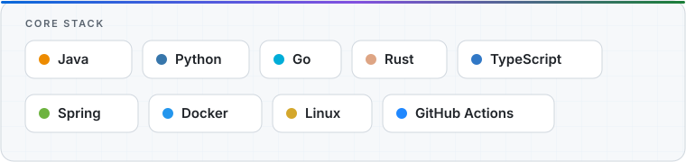

<a href="https://github.com/dajinglingpake?tab=repositories">
  <picture>
    <source media="(prefers-color-scheme: dark)" srcset="./assets/profile-hero.svg" />
    <source media="(prefers-color-scheme: light)" srcset="./assets/profile-hero.svg" />
    
  </picture>
</a>

## 关于我

我关注 AI 辅助开发、后端系统、网络工具链和个人效率工具，喜欢把高频工程流程做成小而可靠的工具。

- 构建 coding agents、developer tooling、proxy/network stacks 和 knowledge workflows。
- 使用 Java、Python、Go、Rust 与 TypeScript 完成从想法到交付。
- 通过 PR、Issue 和代码变更持续参与开源项目。

## 重点项目

### [chatbridge](https://github.com/dajinglingpake/chatbridge)

连接微信、多 AI 会话与本地 agent CLI 的统一入口。

`AI Agent` · `CLI` · `Developer Workflow`

### [mihomo-proxy-stack](https://github.com/dajinglingpake/mihomo-proxy-stack)

面向无界面 Linux 的 mihomo、MetaCubeXD 与 Sub-Store 部署栈。

`Network` · `Docker` · `Linux`

### [MyThinkMap](https://github.com/dajinglingpake/MyThinkMap)

带 Docker Web UI 和 MCP 知识检索的个人知识地图。

`MCP` · `Knowledge Base` · `Web UI`

## 技术栈

<picture>
  <source media="(prefers-color-scheme: dark)" srcset="./assets/tech-stack.svg" />
  <source media="(prefers-color-scheme: light)" srcset="./assets/tech-stack.svg" />
  
</picture>

## 开源参与

以下是我参与过的代表性开源项目。

<!-- CONTRIBUTED-REPOS:START -->
<ul>
<li><strong><a href="https://github.com/openai/codex">openai/codex</a></strong></li>
<li><strong><a href="https://github.com/decolua/9router">decolua/9router</a></strong></li>
<li><strong><a href="https://github.com/zhouxiaoka/autoclip">zhouxiaoka/autoclip</a></strong></li>
<li><strong><a href="https://github.com/burrowers/garble">burrowers/garble</a></strong></li>
</ul>
<!-- CONTRIBUTED-REPOS:END -->

## 贡献动态

<picture>
  <source media="(prefers-color-scheme: dark)" srcset="https://raw.githubusercontent.com/dajinglingpake/dajinglingpake/output/github-contribution-grid-snake-dark.svg" />
  <source media="(prefers-color-scheme: light)" srcset="https://raw.githubusercontent.com/dajinglingpake/dajinglingpake/output/github-contribution-grid-snake.svg" />
  
</picture>

<em>由 GitHub Actions 每日自动生成</em>

