 

## `> whoami`

我关注 AI 辅助开发、后端系统、网络工具链和个人效率工具，喜欢把高频工程流程做成小而可靠的工具。

- 构建 coding agents、developer tooling、proxy/network stacks 和 knowledge workflows。
- 使用 Java、Python、Go、Rust、JavaScript 与 TypeScript 完成从想法到交付。
- 通过 PR、Issue 和代码变更持续参与开源项目。

## `> featured_projects`

### [chatbridge](https://github.com/dajinglingpake/chatbridge)

连接微信、多 AI 会话与本地 agent CLI 的统一入口。

`AI Agent` `CLI` `Developer Workflow` · [打开仓库 →](https://github.com/dajinglingpake/chatbridge)

---

### [mihomo-proxy-stack](https://github.com/dajinglingpake/mihomo-proxy-stack)

面向无界面 Linux 的 mihomo、MetaCubeXD 与 Sub-Store 部署栈。

`Network` `Docker` `Linux` · [打开仓库 →](https://github.com/dajinglingpake/mihomo-proxy-stack)

---

### [MyThinkMap](https://github.com/dajinglingpake/MyThinkMap)

带 Docker Web UI 和 MCP 知识检索的个人知识地图。

`MCP` `Knowledge Base` `Web UI` · [打开仓库 →](https://github.com/dajinglingpake/MyThinkMap)

## `> tech_stack`

## `> open_source_contributions`

以下入口分别指向项目主页和我在该项目中公开提交的 PR / Issue。

<!-- CONTRIBUTED-REPOS:START -->
<ul>
<li>
<strong>openai/codex</strong> — Lightweight coding agent that runs in your terminal. 
<a href="https://github.com/openai/codex">访问仓库</a> · <a href="https://github.com/openai/codex/issues?q=author%3Adajinglingpake">查看我的 PR / Issue</a>
</li>
<li>
<strong>decolua/9router</strong> — Connect coding agents to multiple AI providers with automatic fallback. 
<a href="https://github.com/decolua/9router">访问仓库</a> · <a href="https://github.com/decolua/9router/issues?q=author%3Adajinglingpake">查看我的 PR / Issue</a>
</li>
<li>
<strong>zhouxiaoka/autoclip</strong> — AI-powered video clipping and highlight generation. 
<a href="https://github.com/zhouxiaoka/autoclip">访问仓库</a> · <a href="https://github.com/zhouxiaoka/autoclip/issues?q=author%3Adajinglingpake">查看我的 PR / Issue</a>
</li>
<li>
<strong>burrowers/garble</strong> — Obfuscate Go builds. 
<a href="https://github.com/burrowers/garble">访问仓库</a> · <a href="https://github.com/burrowers/garble/issues?q=author%3Adajinglingpake">查看我的 PR / Issue</a>
</li>
</ul>
<!-- CONTRIBUTED-REPOS:END -->

## `> contribution_stream`

<picture>
  <source media="(prefers-color-scheme: dark)" srcset="https://raw.githubusercontent.com/dajinglingpake/dajinglingpake/output/github-contribution-grid-snake-dark.svg" />
  <source media="(prefers-color-scheme: light)" srcset="https://raw.githubusercontent.com/dajinglingpake/dajinglingpake/output/github-contribution-grid-snake.svg" />
  
</picture>

